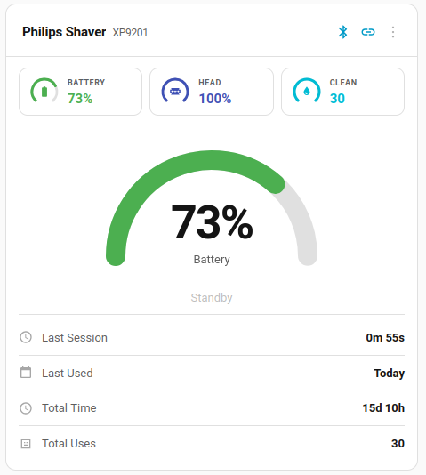
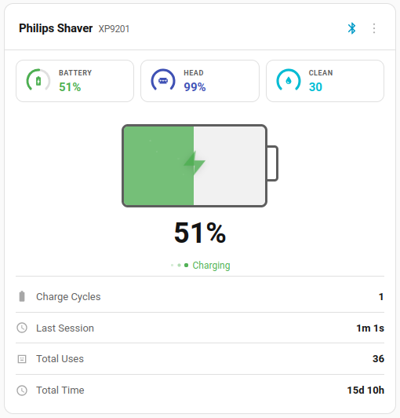
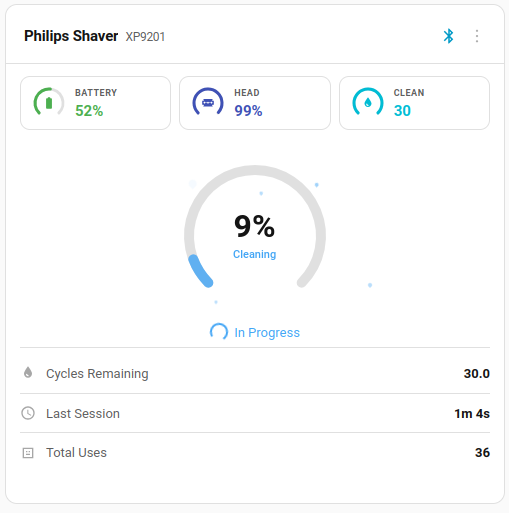
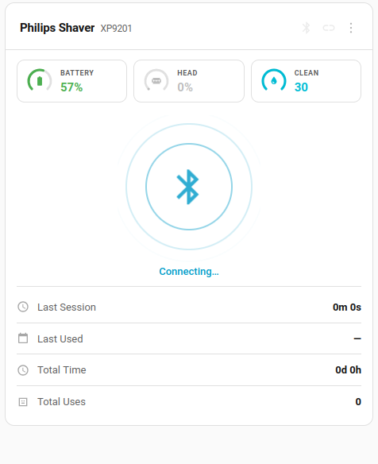
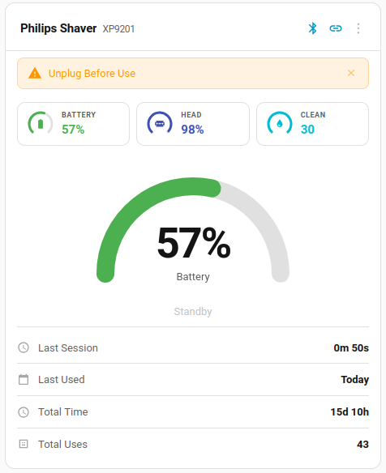

# Philips Shaver Card

[](https://github.com/hacs/integration)
[](https://github.com/mtheli/philips_shaver_card/releases)
[](LICENSE)

Custom Lovelace card for the [Philips Shaver](https://github.com/mtheli/philips_shaver) Home Assistant integration.


## Features

- **Pressure gauge** with animated needle during shaving (blue/green/orange zones)
- **Battery gauge** with animated charging visualization
- **Cleaning ring gauge** with droplet animation during cleaning cycles
- **Shaver head** remaining bar
- **OneBlade support** with speed gauge and adapted stats
- **Notification banner** — active warnings (motor blocked, head replacement, etc.) shown as dismissible alerts with per-notification clearing
- **Connecting animation** — animated Bluetooth icon while the integration is initializing
- **Context-dependent stats**: motor RPM & current during shaving, session history in standby, charge info while charging
- **Clickable elements** — tap header, battery, or head bar to open the entity's more-info dialog
- **Multi-language support** — English and German, auto-detected from your Home Assistant language setting

The card automatically switches between modes based on the shaver's activity state:

| Standby | Shaving | Charging | Cleaning |
| :---: | :---: | :---: | :---: |
|  |  |  |  |

| Connecting | Warning |
| :---: | :---: |
|  |  |

## Community

- [Smartes Badezimmer? So hilft dir ein Shelly Wall Display beim Zähneputzen & Rasieren!](https://www.youtube.com/watch?v=ROI91x2Swv8) — Video by smartmatic showing the card on a Shelly Wall Display with XP9405 and ESP32 Bridge (German)

## Installation

### HACS (Recommended)

1. Go to **HACS** > **Frontend**
2. Click the three-dot menu > **Custom repositories**
3. Add `https://github.com/mtheli/philips_shaver_card` with category **Dashboard**
4. Find "Philips Shaver Card" and click **Install**
5. Reload your browser

### Manual

1. Download `philips_shaver_card.js` from the [latest release](https://github.com/mtheli/philips_shaver_card/releases/latest)
2. Copy it to `config/www/philips_shaver_card.js`
3. Add the resource in **Settings** > **Dashboards** > **Resources**:
   - URL: `/local/philips_shaver_card.js`
   - Type: JavaScript Module

## Configuration

The card uses a visual editor — just add a card and select **Philips Shaver Card** from the list. Pick your shaver device and you're done.

### YAML

```yaml
type: custom:philips-shaver-card
device_id: <your-device-id>
title: My Shaver   # optional, defaults to "Philips Shaver"
show_model: true   # optional, show model number as subtitle (default: true)
```

## Supported Languages

| Language | Code |
| --- | --- |
| English | `en` |
| German / Deutsch | `de` |

The card automatically uses your Home Assistant language setting. Unsupported languages fall back to English. Contributions for additional languages are welcome — just add a new JSON file in `src/locales/`.

## Requirements

- [Philips Shaver](https://github.com/mtheli/philips_shaver) integration (v0.10.0+)
- Home Assistant 2024.11.0+

## License

[MIT](LICENSE)
